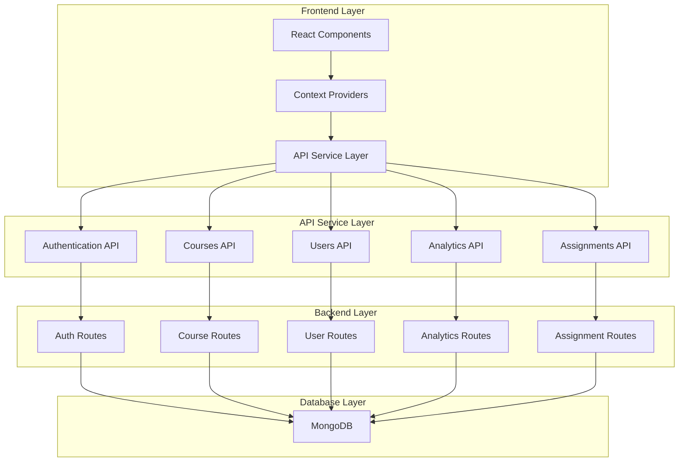

# Teacher Data Management and Mock Data Removal Design

## Overview

This design document outlines the comprehensive approach to fix teacher role functionality, remove all mock data from the system, ensure proper MongoDB integration, and fix sidebar navigation issues. The solution focuses on creating a fully functional, database-driven system that eliminates hardcoded data and provides proper role-based access control.

## Architecture

### Current System Analysis

**Backend Structure:**
- Flask-based API with MongoDB integration
- Existing routes: auth, courses, assignments, users, analytics, notifications, videos, progress
- JWT-based authentication with role verification
- Proper database schemas already established

**Frontend Structure:**
- React with TypeScript
- Context-based state management (AuthContext, LMSContext)
- Role-based sidebar components (TeacherSidebar, SuperAdminSidebar)
- Component-based architecture with proper separation

**Identified Issues:**
1. Mock data in LMSContext and various components
2. Hardcoded statistics and metrics in dashboards
3. Incomplete teacher functionality integration
4. Sidebar navigation inconsistencies
5. Missing real-time data synchronization

### Target Architecture



## Components and Interfaces

### 1. API Service Layer Enhancement

**New API Services:**
```typescript
// src/services/api.ts
interface TeacherAPI {
  getDashboardStats(): Promise<TeacherStats>
  getCourses(): Promise<Course[]>
  getStudents(): Promise<Student[]>
  getAssignments(): Promise<Assignment[]>
  getAnalytics(): Promise<TeacherAnalytics>
}

interface CourseAPI {
  create(courseData: CreateCourseRequest): Promise<Course>
  update(id: string, data: UpdateCourseRequest): Promise<Course>
  delete(id: string): Promise<void>
  getStudents(courseId: string): Promise<Student[]>
  uploadMaterial(courseId: string, material: MaterialData): Promise<Material>
}
```

### 2. Context Layer Refactoring

**Enhanced LMSContext:**
```typescript
interface LMSContextType {
  // Remove all mock data
  courses: Course[]
  assignments: Assignment[]
  announcements: Announcement[]
  
  // Add real data management
  loading: boolean
  error: string | null
  
  // Data fetching methods
  fetchCourses(): Promise<void>
  fetchAssignments(): Promise<void>
  fetchAnnouncements(): Promise<void>
  
  // UI state
  sidebarOpen: boolean
  setSidebarOpen: (open: boolean) => void
}
```

### 3. Component Architecture

**Teacher Dashboard Components:**
- `TeacherDashboard` - Main dashboard with real statistics
- `TeacherStats` - Real-time statistics from database
- `CourseManagement` - CRUD operations for courses
- `StudentManagement` - View and manage enrolled students
- `AssignmentGrading` - Real assignment grading interface

**Sidebar Components:**
- `TeacherSidebar` - Role-specific navigation
- `SuperAdminSidebar` - Admin-specific navigation
- `StudentSidebar` - Student-specific navigation (if needed)

## Data Models

### 1. Enhanced Course Model

```typescript
interface Course {
  _id: string
  title: string
  description: string
  teacher_id: string
  teacher_name: string
  category: string
  difficulty: 'Beginner' | 'Intermediate' | 'Advanced'
  duration: string
  prerequisites: string[]
  learning_objectives: string[]
  thumbnail: string
  is_active: boolean
  is_public: boolean
  max_students: number
  enrolled_students: number
  created_at: Date
  updated_at: Date
  materials: Material[]
  assignments: Assignment[]
}
```

### 2. Teacher Statistics Model

```typescript
interface TeacherStats {
  active_courses: number
  total_students: number
  pending_grades: number
  course_rating: number
  monthly_growth: {
    courses: number
    students: number
    rating_change: number
  }
}
```

### 3. Real-time Analytics Model

```typescript
interface TeacherAnalytics {
  course_performance: CoursePerformance[]
  student_engagement: StudentEngagement[]
  assignment_statistics: AssignmentStats
  recent_activities: Activity[]
}
```

## Error Handling

### 1. API Error Handling Strategy

```typescript
class APIError extends Error {
  constructor(
    public status: number,
    public message: string,
    public code?: string
  ) {
    super(message)
  }
}

// Centralized error handling
const handleAPIError = (error: any): APIError => {
  if (error.response) {
    return new APIError(
      error.response.status,
      error.response.data.error || 'API Error',
      error.response.data.code
    )
  }
  return new APIError(500, 'Network Error')
}
```

### 2. Component Error Boundaries

```typescript
interface ErrorBoundaryState {
  hasError: boolean
  error: Error | null
}

class TeacherDashboardErrorBoundary extends Component<Props, ErrorBoundaryState> {
  // Handle teacher-specific errors
  // Provide fallback UI for teacher components
}
```

### 3. Loading States and Fallbacks

- Skeleton loaders for dashboard statistics
- Empty states for courses, assignments, and students
- Retry mechanisms for failed API calls
- Offline state handling

## Testing Strategy

### 1. Unit Testing

**API Services Testing:**
```typescript
describe('TeacherAPI', () => {
  test('should fetch real dashboard stats', async () => {
    const stats = await teacherAPI.getDashboardStats()
    expect(stats.active_courses).toBeGreaterThanOrEqual(0)
    expect(stats.total_students).toBeGreaterThanOrEqual(0)
  })
})
```

**Component Testing:**
```typescript
describe('TeacherDashboard', () => {
  test('should display real data from API', async () => {
    render(<TeacherDashboard />)
    await waitFor(() => {
      expect(screen.getByText(/Active Courses/)).toBeInTheDocument()
    })
  })
})
```

### 2. Integration Testing

- Test complete teacher workflow: login → dashboard → course creation → student management
- Test role-based access control
- Test data persistence across sessions
- Test sidebar navigation functionality

### 3. End-to-End Testing

- Teacher creates course and adds materials
- Student enrolls and completes assignments
- Teacher grades assignments and views analytics
- Data consistency verification

## Implementation Phases

### Phase 1: Backend API Enhancement
1. Enhance existing routes with proper teacher statistics
2. Add missing analytics endpoints
3. Implement real-time data aggregation
4. Add proper error handling and validation

### Phase 2: Frontend API Integration
1. Remove all mock data from contexts and components
2. Implement proper API service layer
3. Add loading states and error handling
4. Update components to use real data

### Phase 3: Teacher Dashboard Overhaul
1. Replace hardcoded statistics with real data
2. Implement proper course management interface
3. Add real student management functionality
4. Integrate assignment grading system

### Phase 4: Sidebar and Navigation Fix
1. Implement proper role-based sidebar rendering
2. Fix navigation routing and state management
3. Add proper responsive behavior
4. Ensure consistent styling across roles

### Phase 5: Testing and Validation
1. Comprehensive testing of all teacher functionality
2. Data consistency validation
3. Performance optimization
4. User acceptance testing

## Security Considerations

### 1. Role-Based Access Control
- Verify teacher role on all teacher-specific endpoints
- Ensure teachers can only access their own courses and students
- Implement proper authorization middleware

### 2. Data Validation
- Validate all input data on both frontend and backend
- Sanitize user inputs to prevent XSS attacks
- Implement proper file upload validation for course materials

### 3. Authentication
- Maintain existing JWT-based authentication
- Implement proper token refresh mechanisms
- Add session management for concurrent logins

## Performance Optimization

### 1. Data Fetching Optimization
- Implement pagination for large datasets
- Add caching for frequently accessed data
- Use lazy loading for course materials and assignments

### 2. Frontend Optimization
- Implement proper memoization for expensive calculations
- Use React.memo for component optimization
- Add virtual scrolling for large lists

### 3. Database Optimization
- Add proper indexing for teacher-related queries
- Implement aggregation pipelines for statistics
- Optimize queries for dashboard data

## Migration Strategy

### 1. Data Migration
- No data migration needed (removing mock data only)
- Ensure existing database data is properly formatted
- Add any missing indexes for performance

### 2. Code Migration
- Gradual replacement of mock data with API calls
- Maintain backward compatibility during transition
- Implement feature flags for gradual rollout

### 3. Testing Migration
- Update existing tests to work with real data
- Add new tests for enhanced functionality
- Ensure test data setup for development environment